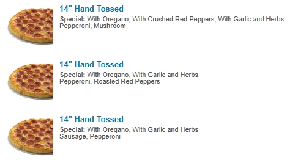

# SODERRA - DIGITAL PORTFOLIO
---
### SODERRA
Soderra is the name of my collection of work in my various fields of interest. The collection covers architectural proposals, music, interactive media and digital artwork. 

### ABOUT THIS PAGE
This repository is designed to be a copy of my website that contains my work in visual and auditory interactive design. The website functions as a digital portfolio of my work, and the various projects I have. This website in of itself was also a tool to learn how to code in HTML and is the outcome of a lengthy process of learning how to integrate design work into functioning websites or webapps.

### PROJECT TYPES
| **TYPOLOGY** | **DESCRIPTION** |
| :----- | :----- |
| ARCHITECTURE | Architecture, landscape architecture, and urban design proposals |
| PHOTOGRAPHY/VISUAL ART | Photography, concept art, 3D modelling|
| SOUND DESIGN | Music, soundscapes and other audio based work |
| INTERACTIVE MEDIA | Interactive experiences and user experience projects |
---
### WEBSITE LINK
https://j-a-sod.github.io/SODERRA/

### PROJECT LINK
https://github.com/J-A-SOD/SODERRA/tree/dev

### PROCESS IMAGES

